# ☸️ Kubernetes for DevOps Engineers — Deploy Store App on Amazon EKS with CloudWatch Monitoring

---

# 📘 Project Overview

This project demonstrates how to deploy a microservices application on Amazon Elastic Kubernetes Service (EKS) and monitor the Kubernetes environment using Amazon CloudWatch.

Students will learn how to:

- Configure AWS CLI
- Create an Amazon EKS cluster
- Connect kubectl to EKS
- Deploy Kubernetes applications
- Expose applications using AWS Load Balancer
- Enable CloudWatch Container Insights
- Monitor logs and metrics
- Generate application traffic
- Clean up AWS resources

This project simulates how real DevOps Engineers deploy and monitor Kubernetes workloads in production environments.

---

# 🎯 LAB OBJECTIVE

By the end of this project, students will understand:

✅ AWS CLI configuration  
✅ Amazon EKS provisioning  
✅ Kubernetes cluster management  
✅ kubectl operations  
✅ Microservices deployment  
✅ Kubernetes LoadBalancer services  
✅ CloudWatch monitoring  
✅ CloudWatch Container Insights  
✅ Kubernetes logging and metrics  
✅ Production Kubernetes monitoring  

---

# 🌍 Real-World Scenario

A DevOps Engineer wants:

- A managed Kubernetes environment
- Automatic scaling and orchestration
- Centralized monitoring and logging
- Visibility into Kubernetes workloads
- Real-time metrics and observability

This is how modern Kubernetes monitoring works in real cloud-native environments.

---

# 🏗️ Project Architecture

```text
AWS CLI
      ↓
Amazon EKS Cluster
      ↓
Kubernetes Worker Nodes
      ↓
Deploy Store Application
      ↓
AWS LoadBalancer Service
      ↓
Public Access to Application
      ↓
CloudWatch Container Insights
      ↓
Logs + Metrics + Monitoring
```

---

# 🧱 Project Structure

```text
eks-store-app/
│
├── aks-store.yaml
├── screenshots/
├── README.md
└── docs/
    ├── architecture.dot
    ├── architecture.png
    └── architecture.svg
```

---

# PART 0 - Create Architecture Diagram

Open:

```bash
mkdir -p docs/
nano docs/architecture.dot
```

Paste:

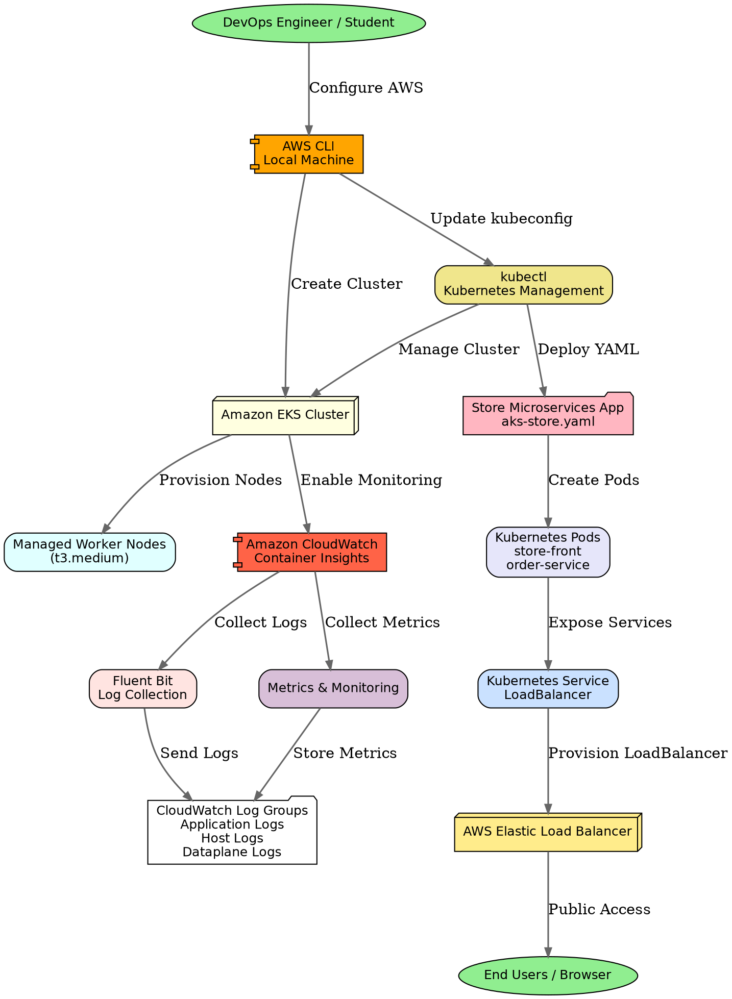

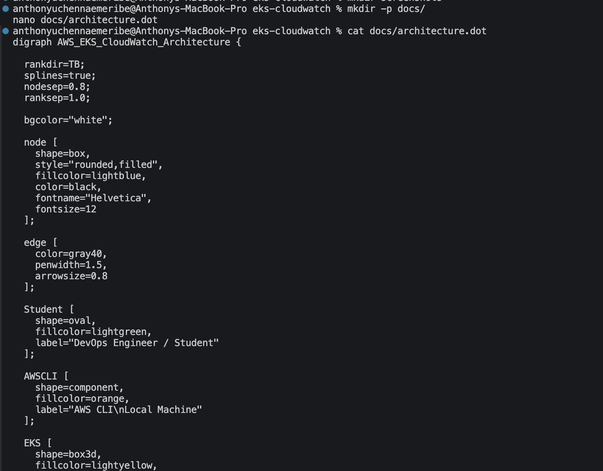

Generate architecture image:

```bash
dot -Tpng docs/architecture.dot -o docs/architecture-diagram.png
```

Generate SVG image:

```bash
dot -Tsvg docs/architecture.dot -o docs/architecture-diagram.svg
```

Open image:

```bash
open docs/architecture-diagram.png
```

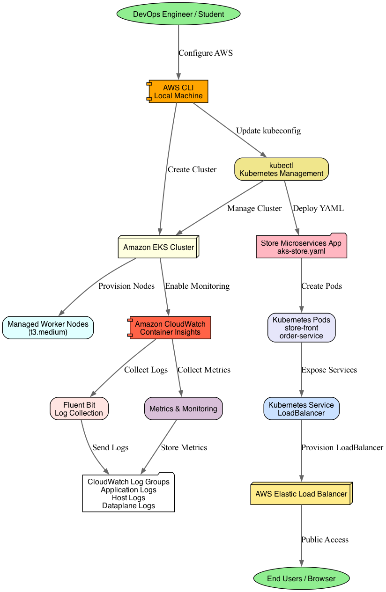
---

# 🚀 PART 1 — Install Prerequisites

## 🎯 Objective

Install all required DevOps and Kubernetes tools locally.

---

# Step 1 — Install AWS CLI

Install AWS CLI:

```text
https://docs.aws.amazon.com/cli/latest/userguide/getting-started-install.html
```

Verify installation:

```bash
aws --version
```
[AWS CLI Installation Verification](screenshots/aws-cli-installation-verification.png)
---

# Step 2 — Install kubectl

Verify kubectl installation:

```bash
kubectl version --client
```
[Kubectl Installation Verification](screenshots/kubectl-installation-verification.png)
---

# Step 3 — Install eksctl

## Linux

Download latest eksctl release:

```bash
ARCH=amd64
PLATFORM=$(uname -s)_$ARCH

curl -sLO "https://github.com/eksctl-io/eksctl/releases/latest/download/eksctl_${PLATFORM}.tar.gz"
```

Extract archive:

```bash
tar -xzf eksctl_${PLATFORM}.tar.gz -C /tmp
```

Move eksctl binary:

```bash
sudo mv /tmp/eksctl /usr/local/bin
```

Verify installation:

```bash
eksctl version
```

---

## macOS

Install using Homebrew:

```bash
brew tap weaveworks/tap

brew install weaveworks/tap/eksctl
```
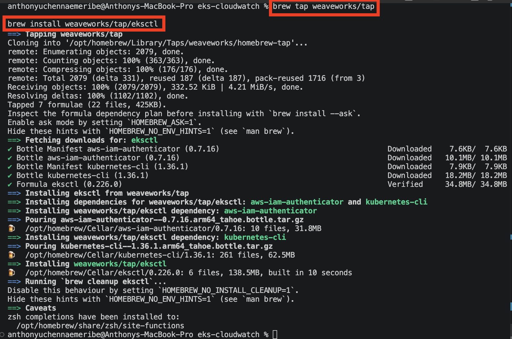

Verify installation:

```bash
eksctl version
```
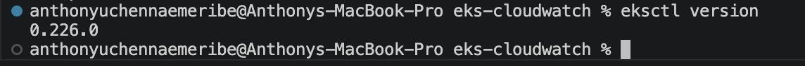
---

## Windows (Chocolatey)

Install eksctl:

```bash
choco install eksctl -y
```

Verify installation:

```bash
eksctl version
```

---

# ✅ Expected Output

```text
0.xxx.x
```

---

# Step 4 — Install Tools Using Chocolatey (Windows)

```bash
choco install eksctl awscli kubernetes-cli -y
```

---

# 🚀 PART 2 — Configure AWS CLI

## 🎯 Objective

Configure AWS credentials locally.

---

# Step 1 — Configure AWS CLI

Run:

```bash
aws configure
```

Provide:

```text
AWS Access Key ID
AWS Secret Access Key
Default region
Default output format
```

Example:

```text
AWS Access Key ID [None]: AKIAXXXXXXXXX
AWS Secret Access Key [None]: xxxxxxxxx
Default region name [None]: us-east-1
Default output format [None]: json
```
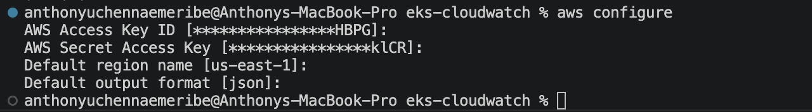

---

# Step 2 — Verify AWS Identity

```bash
aws sts get-caller-identity
```
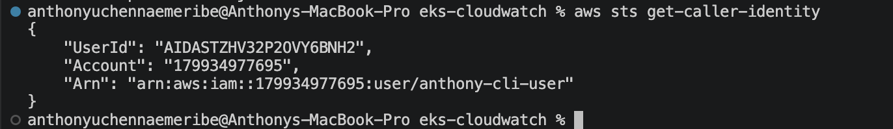
---

# 🚀 PART 3 — Create Amazon EKS Cluster

## 🎯 Objective

Provision a managed Kubernetes cluster on AWS.

---

# Step 1 — Create EKS Cluster

Run:

```bash
eksctl create cluster --name my-eks-cluster --region us-east-1 --nodes 2 --node-type t3.small --managed
```
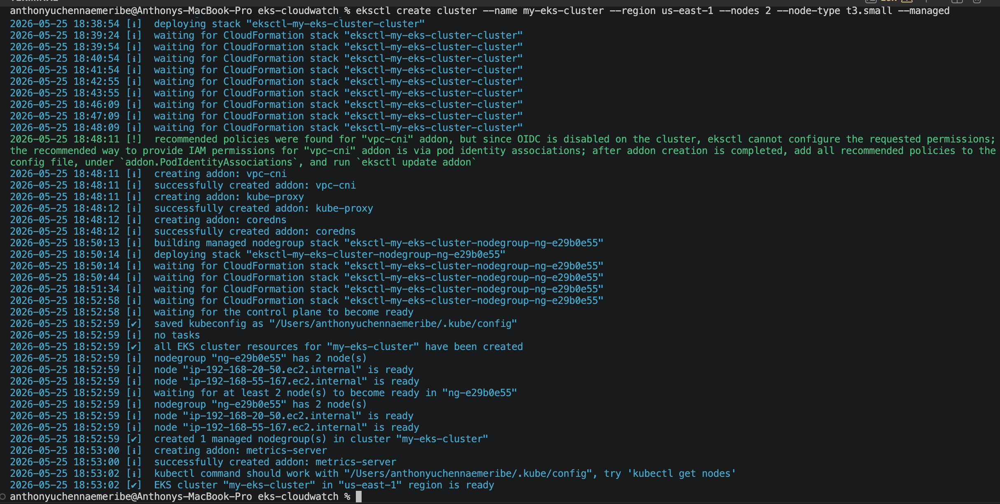

This automatically creates:

- VPC
- Control Plane
- Worker Nodes
- IAM Roles
- Networking Resources


---

# Step 2 — Verify Cluster Creation

```bash
eksctl get cluster --region us-east-1
```
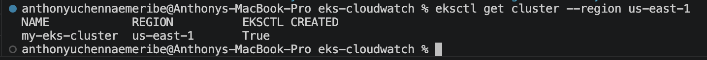
---

# 🚀 PART 4 — Connect kubectl to EKS Cluster

## 🎯 Objective

Connect kubectl to the Kubernetes cluster.

---

# Step 1 — Update kubeconfig

```bash
aws eks update-kubeconfig --region us-east-1 --name my-eks-cluster
```
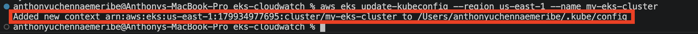
---

# Step 2 — Verify Kubernetes Nodes

```bash
kubectl get nodes
```

---

# ✅ Expected Output

```text
NAME                                            STATUS   ROLES    AGE   VERSION
ip-192-168-1-10.us-east-1.compute.internal      Ready    <none>   10m   v1.xx.x
ip-192-168-1-11.us-east-1.compute.internal      Ready    <none>   10m   v1.xx.x
```
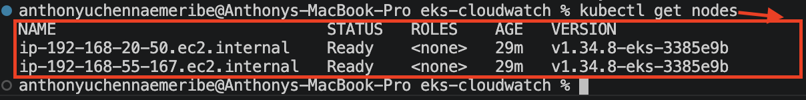
---

# 🚀 PART 5 — Deploy Store Application

## 🎯 Objective

Deploy the Kubernetes microservices application.

---
# Step 1 — Create Kubernetes Manifest File

Create the application manifest file:

```bash
nano aks-store.yaml
```

---

# Step 2 — Add Kubernetes Microservices Manifest

Paste:

```yaml
apiVersion: apps/v1
kind: Deployment
metadata:
  name: rabbitmq
spec:
  replicas: 1
  selector:
    matchLabels:
      app: rabbitmq
  template:
    metadata:
      labels:
        app: rabbitmq
    spec:
      nodeSelector:
        "kubernetes.io/os": linux
      containers:
      - name: rabbitmq
        image: mcr.microsoft.com/mirror/docker/library/rabbitmq:3.10-management-alpine
        ports:
        - containerPort: 5672
          name: rabbitmq-amqp
        - containerPort: 15672
          name: rabbitmq-http
        env:
        - name: RABBITMQ_DEFAULT_USER
          value: "username"
        - name: RABBITMQ_DEFAULT_PASS
          value: "password"
        resources:
          requests:
            cpu: 10m
            memory: 128Mi
          limits:
            cpu: 250m
            memory: 256Mi
        volumeMounts:
        - name: rabbitmq-enabled-plugins
          mountPath: /etc/rabbitmq/enabled_plugins
          subPath: enabled_plugins
      volumes:
      - name: rabbitmq-enabled-plugins
        configMap:
          name: rabbitmq-enabled-plugins
          items:
          - key: rabbitmq_enabled_plugins
            path: enabled_plugins
---
apiVersion: v1
data:
  rabbitmq_enabled_plugins: |
    [rabbitmq_management,rabbitmq_prometheus,rabbitmq_amqp1_0].
kind: ConfigMap
metadata:
  name: rabbitmq-enabled-plugins
---
apiVersion: v1
kind: Service
metadata:
  name: rabbitmq
spec:
  selector:
    app: rabbitmq
  ports:
    - name: rabbitmq-amqp
      port: 5672
      targetPort: 5672
    - name: rabbitmq-http
      port: 15672
      targetPort: 15672
  type: ClusterIP
---
apiVersion: apps/v1
kind: Deployment
metadata:
  name: order-service
spec:
  replicas: 1
  selector:
    matchLabels:
      app: order-service
  template:
    metadata:
      labels:
        app: order-service
    spec:
      nodeSelector:
        "kubernetes.io/os": linux
      containers:
      - name: order-service
        image: ghcr.io/azure-samples/aks-store-demo/order-service:latest
        ports:
        - containerPort: 3000
        env:
        - name: ORDER_QUEUE_HOSTNAME
          value: "rabbitmq"
        - name: ORDER_QUEUE_PORT
          value: "5672"
        - name: ORDER_QUEUE_USERNAME
          value: "username"
        - name: ORDER_QUEUE_PASSWORD
          value: "password"
        - name: ORDER_QUEUE_NAME
          value: "orders"
        - name: FASTIFY_ADDRESS
          value: "0.0.0.0"
        resources:
          requests:
            cpu: 1m
            memory: 50Mi
          limits:
            cpu: 75m
            memory: 128Mi
      initContainers:
      - name: wait-for-rabbitmq
        image: busybox
        command: ['sh', '-c', 'until nc -zv rabbitmq 5672; do echo waiting for rabbitmq; sleep 2; done;']
        resources:
          requests:
            cpu: 1m
            memory: 50Mi
          limits:
            cpu: 75m
            memory: 128Mi
---
apiVersion: v1
kind: Service
metadata:
  name: order-service
spec:
  type: ClusterIP
  ports:
  - name: http
    port: 3000
    targetPort: 3000
  selector:
    app: order-service
---
apiVersion: apps/v1
kind: Deployment
metadata:
  name: product-service
spec:
  replicas: 1
  selector:
    matchLabels:
      app: product-service
  template:
    metadata:
      labels:
        app: product-service
    spec:
      nodeSelector:
        "kubernetes.io/os": linux
      containers:
      - name: product-service
        image: ghcr.io/azure-samples/aks-store-demo/product-service:latest
        ports:
        - containerPort: 3002
        resources:
          requests:
            cpu: 10m
            memory: 64Mi
          limits:
            cpu: 100m
            memory: 128Mi
---
apiVersion: v1
kind: Service
metadata:
  name: product-service
spec:
  type: ClusterIP
  ports:
  - name: http
    port: 3002
    targetPort: 3002
  selector:
    app: product-service
---
apiVersion: apps/v1
kind: Deployment
metadata:
  name: store-front
spec:
  replicas: 1
  selector:
    matchLabels:
      app: store-front
  template:
    metadata:
      labels:
        app: store-front
    spec:
      nodeSelector:
        "kubernetes.io/os": linux
      containers:
      - name: store-front
        image: ghcr.io/azure-samples/aks-store-demo/store-front:latest
        ports:
        - containerPort: 8080
          name: store-front
        env:
        - name: VUE_APP_ORDER_SERVICE_URL
          value: "http://order-service:3000/"
        - name: VUE_APP_PRODUCT_SERVICE_URL
          value: "http://product-service:3002/"
        resources:
          requests:
            cpu: 1m
            memory: 200Mi
          limits:
            cpu: 1000m
            memory: 512Mi
---
apiVersion: v1
kind: Service
metadata:
  name: store-front
spec:
  type: LoadBalancer
  ports:
  - port: 80
    targetPort: 8080
  selector:
    app: store-front
```

---

# Step 3 — Save File

Press:

```text
CTRL + O
Enter
CTRL + X
```
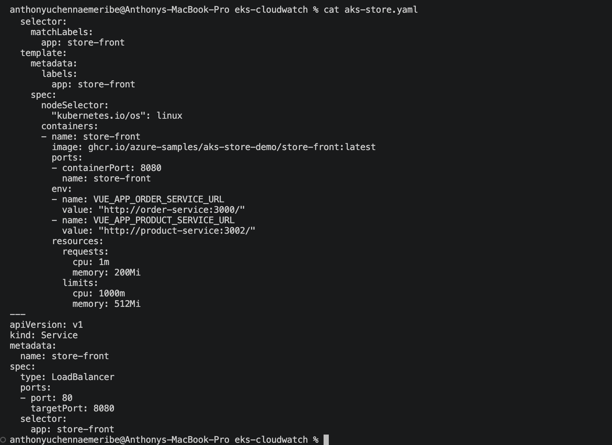

# Step 4 — Deploy Application YAML

```bash
kubectl apply -f aks-store.yaml
```
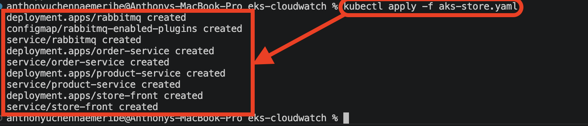
---

# Step 5 — Verify Pods

```bash
kubectl get pods
```
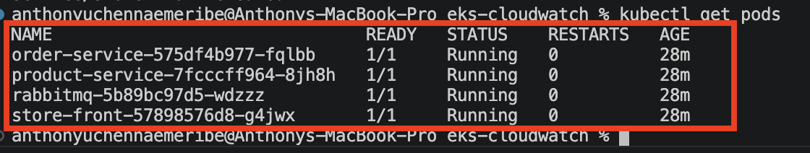
---

# Step 6 — Verify Services

```bash
kubectl get services
```
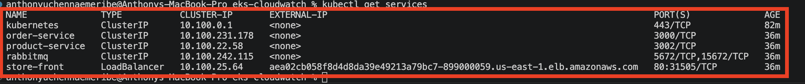
---

# 🚀 PART 6 — Access the Application

## 🎯 Objective

Expose the application publicly using AWS LoadBalancer.

---

# Step 1 — Get LoadBalancer URL

```bash
kubectl get service store-front
```

Look for:

```text
EXTERNAL-IP
```

Example:

```text
a1b2c3d4e5f6.us-west-2.elb.amazonaws.com
```
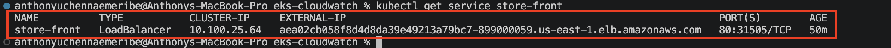
---

# Step 2 — Open Application

Open browser:

```text
http://public-dns
```

Example:

```text
aea02cb058f8d4d8da39e49213a79bc7-899000059.us-east-1.elb.amazonaws.com
```
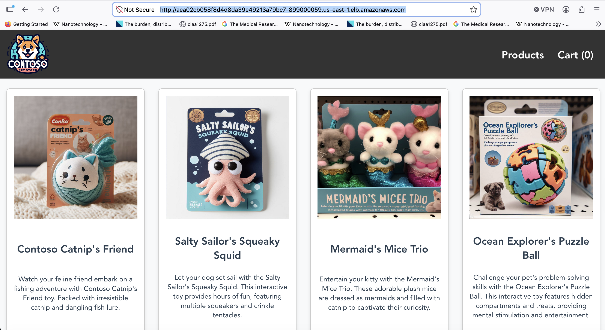
---

# 🚀 PART 7 — Enable CloudWatch Monitoring

## 🎯 Objective

Enable centralized Kubernetes logging and monitoring using CloudWatch Container Insights.

---

# Step 1 — Associate IAM OIDC Provider

```bash
eksctl utils associate-iam-oidc-provider --region us-east-1 --cluster my-eks-cluster --approve
```
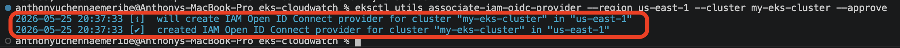
---

# Step 2 — Install CloudWatch Observability Add-on

```bash
eksctl create addon --name amazon-cloudwatch-observability --cluster my-eks-cluster --region us-east-1 --force
```

This automatically installs:

- Fluent Bit
- CloudWatch Agent
- Container Insights Integration

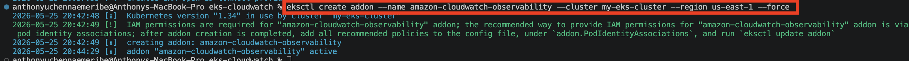

---

# Step 3 — Verify CloudWatch Log Groups

```bash
aws logs describe-log-groups --region us-east-1
```

---

# 🚀 PART 8 — Enable EKS Control Plane Logging

## 🎯 Objective

Enable advanced Kubernetes control plane logging.

---

# Step 1 — Enable Cluster Logging

```bash
aws eks update-cluster-config \
  --region us-west-2 \
  --name my-eks-cluster \
  --logging '{"clusterLogging":[{"types":["api","audit","authenticator","controllerManager","scheduler"],"enabled":true}]}'
```

---

# Step 2 — Reinstall CloudWatch Add-on

```bash
eksctl create addon \
  --name amazon-cloudwatch-observability \
  --cluster my-eks-cluster \
  --region us-west-2
```

---

# 🚀 PART 9 — Verify CloudWatch Logs

## 🎯 Objective

Verify Kubernetes logs are sent to CloudWatch.

---

# Step 1 — View Log Groups

Run:

```bash
aws logs describe-log-groups --region us-east-1
```

Expected log groups:

```text
/aws/containerinsights/my-eks-cluster/application
/aws/containerinsights/my-eks-cluster/host
/aws/containerinsights/my-eks-cluster/dataplane
```
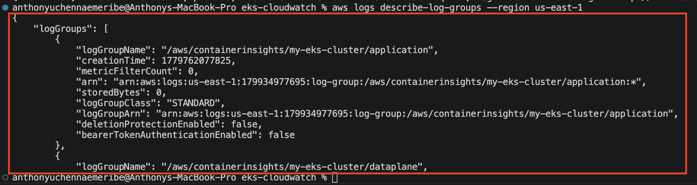
---

# 🚀 PART 10 — Test Logging & Monitoring

## 🎯 Objective

Generate application logs and verify observability.

---

# Step 1 — View Store Front Logs

```bash
kubectl logs deployment/store-front
```
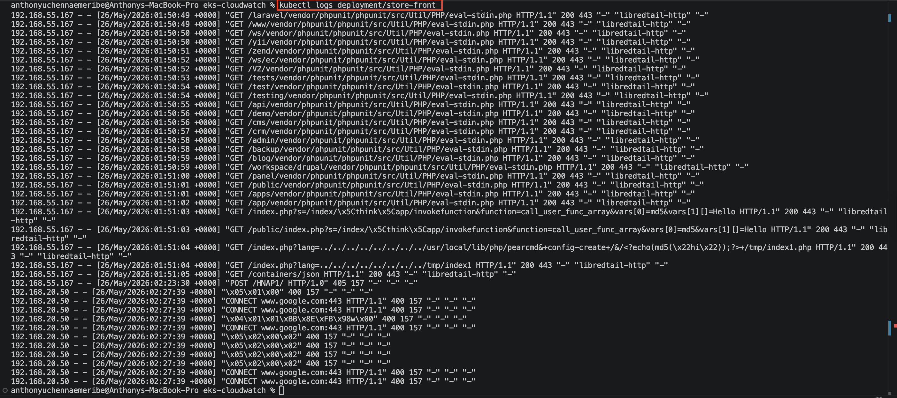
---

# Step 2 — View Order Service Logs

```bash
kubectl logs deployment/order-service
```
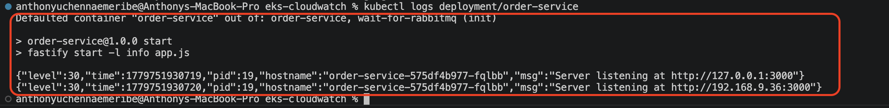
---

# Step 3 — Generate Traffic

Refresh the application continuously in browser.

---

# Step 4 — Verify Logs in CloudWatch

Run:

```bash
aws logs describe-log-groups --region us-east-1
```

You should now see active logs and metrics generated automatically.

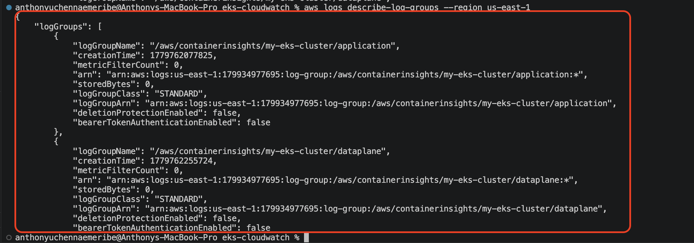

---

# ❌ Common EKS Cluster Creation Error

## Error Message 1

```text
Error: failed to create cluster "my-eks-cluster"
exceeded max wait time for StackCreateComplete waiter
```
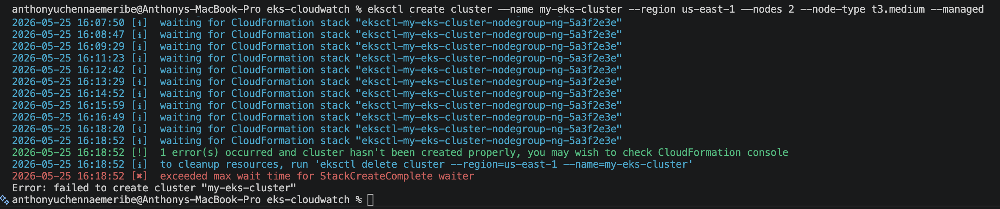
---

# ✅ Cause

This error happens when AWS CloudFormation cannot complete EKS infrastructure provisioning within the expected time.

Possible causes include:

- EC2 quota limits exceeded
- Unsupported availability zone capacity
- IAM permission issues
- Existing failed VPC resources
- Region temporary capacity problems

---
# Troubleshooting Steps

# ✅ Step 1 — Delete Failed Cluster Resources

Run:

```bash
eksctl delete cluster --name my-eks-cluster --region us-east-1
```

Wait until cleanup finishes completely.

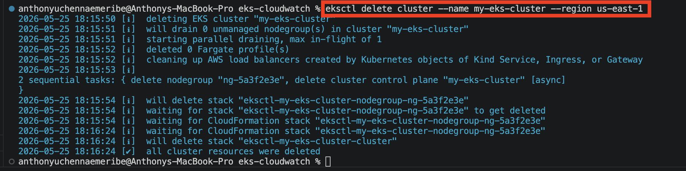

---

# ✅ Step 2 — Verify No Failed CloudFormation Stacks Exist

Run:

```bash
aws cloudformation list-stacks --stack-status-filter CREATE_FAILED DELETE_FAILED
```
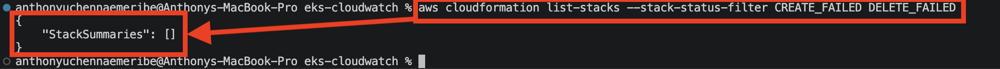

If failed stacks still exist:

```bash
aws cloudformation delete-stack --stack-name STACK_NAME
```

---

# ✅ Step 3 — Check EC2 Quotas

Run:

```bash
aws service-quotas get-service-quota --service-code ec2 --quota-code L-1216C47A
```

This checks vCPU limits.

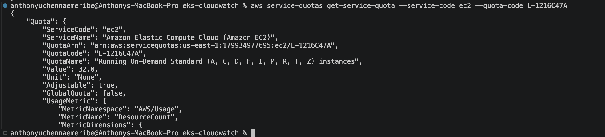
---

# ✅ Step 4 — Retry Using Smaller Instance Type

Sometimes `t3.medium` capacity is unavailable.

Retry using:

```bash
eksctl create cluster --name my-eks-cluster --region us-east-1 --nodes 2 --node-type t3.small --managed
```


OR:

```bash
eksctl create cluster --name my-eks-cluster --region us-east-1 --nodes 1 --node-type t2.medium --managed
```

---

# ✅ Step 5 — Use Another AWS Region

Some regions temporarily run out of EC2 capacity.

Try:

```bash
us-west-2
```

OR:

```bash
eu-west-1
```

Example:

```bash
eksctl create cluster --name my-eks-cluster --region us-east-1 --nodes 2 --node-type t3.small --managed
```

---

# ✅ Step 6 — Verify Cluster Creation

Run:

```bash
eksctl get cluster --region us-east-1
```

---

# ✅ Expected Output

```text
NAME            REGION
my-eks-cluster  us-east-1
```

---

# ✅ Step 7 — Connect kubectl

```bash
aws eks update-kubeconfig --region us-east-1 --name my-eks-cluster
```

---

# ✅ Step 8 — Verify Worker Nodes

```bash
kubectl get nodes
```

Expected:

```text
NAME                                            STATUS   ROLES    AGE   VERSION
NAME                                            STATUS   ROLES    AGE   VERSION
ip-192-168-1-10.us-east-1.compute.internal      Ready    <none>   10m   v1.xx.x
ip-192-168-1-11.us-east-1.compute.internal      Ready    <none>   10m   v1.xx.x
```

---
## Error Message 2

```text
Error: AccessDeniedException
Failed to create log stream
```
The CloudWatch add-on does NOT have IAM permissions to create CloudWatch log streams, even after being successfully installed.

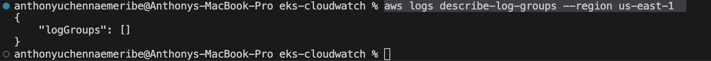

---
# Troubleshooting Steps

# ✅ Step 1 — Get Nodegroup IAM Role
```bash
aws iam list-roles --query "Roles[?contains(RoleName, 'eksctl-my-eks-cluster')].RoleName"
```
Look for:
```text
NodeInstanceRole
```

Example output:
```text
arn:aws:iam::123456789012:role/eksctl-my-eks-cluster-nodegroup-NodeInstanceRole-XXXXX
```

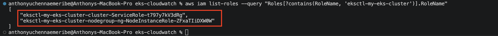

# Step 2 — Attach CloudWatch Agent Policy (Now attach the CloudWatch policy to that role)
```bash
aws iam attach-role-policy --role-name eksctl-my-eks-cluster-nodegroup-ng-NodeInstanceRole-ZFxATIiDXW0W --policy-arn arn:aws:iam::aws:policy/CloudWatchAgentServerPolicy
```
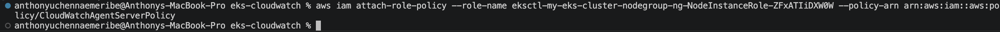

# Step 3 — Restart CloudWatch Pods
```bash
kubectl delete pods -n amazon-cloudwatch --all
```
Kubernetes automatically recreates them.

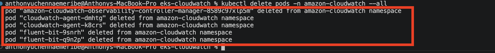

# Step 4 — Verify Pods Restarted
```bash
kubectl get pods -n amazon-cloudwatch
```

Wait until all pods show:
```text
Running
```

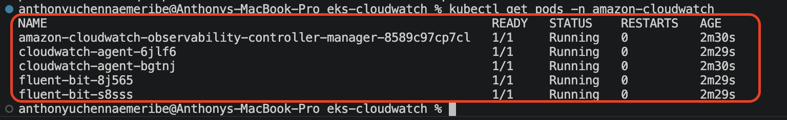

# Step 5 — Generate Logs Again

1. Run:
```bash
kubectl logs deployment/store-front
```


2. And:
```bash
kubectl logs deployment/order-service
```


Refresh your application in browser several times.

# Step 6 — Verify CloudWatch Logs

1. Run
```bash
aws logs describe-log-groups --region us-east-1
```
You should finally see:
```text
/aws/containerinsights/my-eks-cluster/application
/aws/containerinsights/my-eks-cluster/host
/aws/containerinsights/my-eks-cluster/dataplane
```
Your setup is now at the final observability stage.


# 🚀 PART 11 — Cleanup AWS Resources

## 🎯 Objective

Delete Kubernetes infrastructure to avoid AWS charges.

---

# Step 1 — Delete EKS Cluster

```bash
eksctl delete cluster --name my-eks-cluster --region us-east-1
```

This automatically deletes:

- EKS Cluster
- Worker Nodes
- Load Balancers
- VPC Resources
- IAM Resources

# 🚀 LAB 18 — Update GitHub Repo

1. Authenticate GitHub CLI:

```bash
gh auth login
```
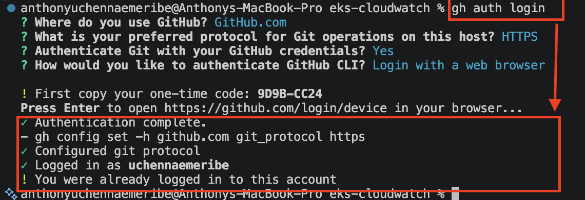

2. Initialize Git:

```bash
git init
```
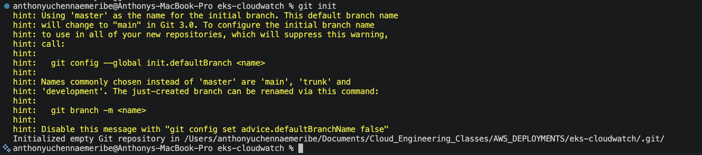

3. Add files:

```bash
git add .
```
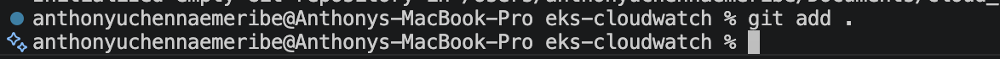

4. Commit:

```bash
git commit -m "Update README.md"
```
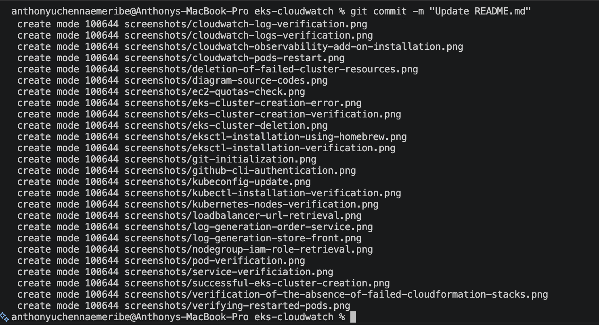

5. Rename branch:

```bash
git branch -M main
```
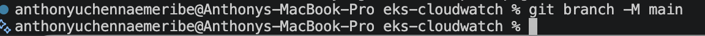

6. Create GitHub repository:

```bash
gh repo create amazon-eks-with-cloudWatch-monitoring --public --source=. --remote=origin --push
```
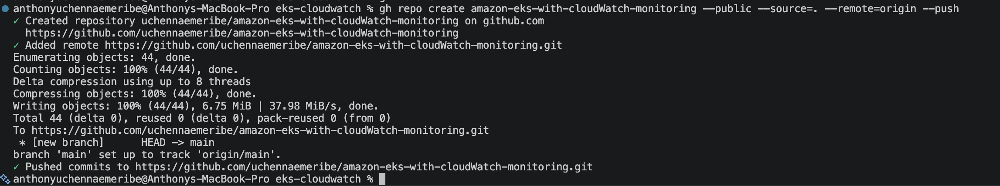
---

# 🧠 Mapping AKS to EKS

| Azure AKS | AWS EKS |
|---|---|
| az aks create | eksctl create cluster |
| Azure Monitor | CloudWatch |
| kubectl apply | kubectl apply |
| Azure LoadBalancer | AWS ELB |

---

# 🧠 Real DevOps Concepts Learned

| Skill | What Student Did |
|---|---|
| AWS CLI | Managed AWS resources |
| Amazon EKS | Provisioned Kubernetes cluster |
| Kubernetes | Managed workloads |
| kubectl | Controlled Kubernetes resources |
| CloudWatch | Monitored logs and metrics |
| Container Insights | Enabled observability |
| Load Balancing | Exposed application publicly |
| Logging | Collected centralized logs |
| Monitoring | Observed Kubernetes health |

---

# 🎯 Final Outcome

You now understand:

✅ AWS CLI configuration  
✅ Amazon EKS provisioning  
✅ Kubernetes cluster management  
✅ Kubernetes application deployment  
✅ LoadBalancer services  
✅ CloudWatch Container Insights  
✅ Kubernetes logging and metrics  
✅ Cloud-native monitoring  
✅ Production Kubernetes observability  

---

# 👨‍💻 Author

**Anthony Uchenna Emeribe**  
Cloud / DevOps Engineer

---

# ⭐ Support

If this project helped you learn Kubernetes deployment and AWS cloud monitoring, consider giving the repository a ⭐ on GitHub.
